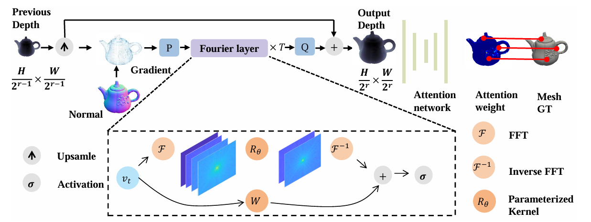

# FNIN (AAAI-2025)

This is the official implementation of paper "FNIN: A Fourier Neural Operator-based Numerical Integration Network for Surface-form-gradients". 


<br />

<p align="center">
  <a href="https://github.com/nailwatts/FNIN/">
    
  </a><br />

  

  <a href="https://github.com/nailwatts/FNIN/">
    
  </a>
</p>


This paper develops a fast two-stage framework for Surface-form-gradients (SfG) problem using data-driven neural operator. Especially, the network part can be integrated into other deep learning system to perform numeraical integration if reasonably modified.
 

## Get started

Run
```sh
conda create -n fnin python=3.10

python -m pip install -r requirements.txt
```
or just install all dependencies one by one manually.

## Test on LUCES dataset

Download dataset from [http://www.robertomecca.com/luces.html](http://www.robertomecca.com/luces.html) and run

```sh
python eval_luces.py <log_dir>  --gpu --checkpoint checkpoint/checkpoint.pth --luces_dataset_root <path_to_luces>
```

## Test on DiLiGenT dataset

Download input (e.g. normal) from [https://github.com/xucao-42/bilateral_normal_integration/tree/main](https://github.com/xucao-42/bilateral_normal_integration/tree/main) and ground truth depth from [https://www.dropbox.com/scl/fi/uhg8538lr43h2g2arim2l/diligent_depth_GT.zip?rlkey=4qdmse25e0lmrtbo9bsfvifk1&e=1&dl=0](https://www.dropbox.com/scl/fi/uhg8538lr43h2g2arim2l/diligent_depth_GT.zip?rlkey=4qdmse25e0lmrtbo9bsfvifk1&e=1&dl=0) 

then run

```sh
python eval_diligent.py <log_dir>  --gpu --checkpoint checkpoint/checkpoint.pth --diligent_dataset_root <path_to_diligent>
```

## Test on our Real (or your own) Dataset

Run
```sh
python eval_real.py <log_dir>  --gpu --checkpoint checkpoint/checkpoint.pth --real_dataset_root <path_to_real>
```
We upload one sample for testing. If you want to test on your own data, please modify the code in "datasets/real_dataset.py".


## Issue

Please feel free to report! Any suggestions are welcomed.

## Acknowledgement

We sincerely thank the authors of following repositories for thieir awesome works:

- Code base: [FastNFPS](https://github.com/dlichy/FastNFPSCode)
- FNO: [neuraloperator](https://github.com/neuraloperator/neuraloperator)
- WLS solver: [BiNI](https://github.com/xucao-42/bilateral_normal_integration)

